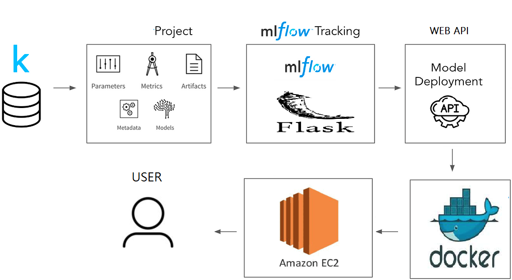
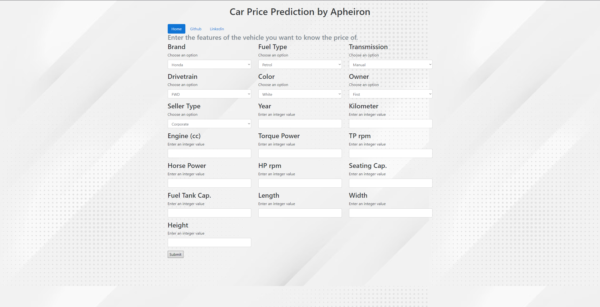
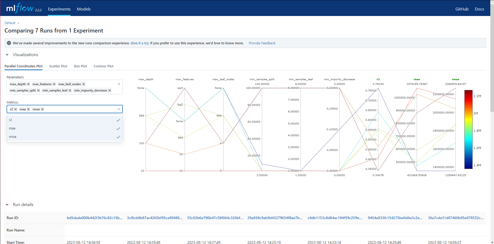

# End-to-End-Machine-Learning-MLflow-Project




### Introduction About the Data :

**The dataset** The goal is to predict `price` of given car (Regression Analysis).

There are 19 independent variables:

*  `Make`                :   Company of the car
*  `Year`                :   Manufacturing Year of the car  
*  `Kilometer`           :   Total kilometers Driven 
*  `Fuel Type`           :   Fuel type of the car 
*  `Transmission`        :   Gear transmission of the car 
*  `Color`               :   Color of the car 
*  `Owner`               :   Number of previous owners 
*  `Seller Type`         :   Tells if car is sold by individual or dealer 
*  `Engine`              :   Engine capacity of the car in cc
*  `Drivetrain`          :   AWD/RWD/FWD
*  `Length`              :   Length of the car in mm
*  `Width`               :   Width of the car in mm
*  `Height`              :   Height of the car in mm
*  `Seating Capacity`    :   Maximum people that can fir in a car
*  `Fuel Tank Capacity`  :   Maximum fuel capacity of the car in litres
*  `TorquePower`         :   Torque power of the car
*  `TorquePowerRPM`      :   Torque power RPM of the car
*  `HorsePower`          :   Horse power of the car
*  `HorsePowerRPM`       :   Horse power RPM of the car

Target variable:
* `price`: Price of the given car.

Dataset Source Link :
https://www.kaggle.com/datasets/nehalbirla/vehicle-dataset-from-cardekho?select=car+details+v4.csv

# Screenshot of UI



# Screenshot of MLflow



# How to run?
### STEPS:

Clone the repository

```bash
https://github.com/Apheironn/End-to-end-Machine-Learning-Project-with-MLflow
```
### STEP 01- Create a conda environment after opening the repository

```bash
conda create -n mlproj python=3.11 -y
```

```bash
conda activate mlproj
```


### STEP 02- install the requirements
```bash
pip install -r requirements.txt
```


```bash
# Finally run the following command
python app.py
```

Now,
```bash
# Open up you local host and port
localhost:8080
```

First go to,
```bash
# You have to train your data first on:
localhost:8080/train
```

Finally,
```bash
# Go back to main address and enter values to estimate the price of the vehicle:
localhost:8080/
```

# Project Stages

1. Create a Repository In Github Account:
    * Created a new GitHub repository to host the project, making version control and collaboration easier.

2. Create Structure Using template.py:
    * Organized the project structure using a Template.py file, establishing a clear layout for code and resources.

3. Implementing setup.py:
    * Implemented a setup.py file to define project dependencies and metadata, simplifying package installation and distribution.

4. Logging Implementation:
    * Integrated logging mechanisms throughout the project, allowing effective tracking of code execution and error debugging.

5. Data Ingestion:
    * Developed data ingestion routines to fetch data from various sources (databases, files, APIs) and prepare it for further processing.

6. Data Validation:
    * Implemented data validation steps to ensure the integrity and quality of incoming data, reducing the risk of incorrect inputs.

7. Data Transformation:
    * Applied data transformation techniques, such as feature engineering and preprocessing, to prepare data for model training.

8. Model Trainer:
    * Developed the model training phase, including selecting an appropriate algorithm, tuning hyperparameters, and fitting the model to the training data.

9. Prediction Pipeline:
    * Created a prediction pipeline that takes in new data, applies the necessary transformations, and generates predictions using the trained model.

10. Set MLflow and Docker:
    * Integrated MLflow to track experiments, model versions, and performance metrics, enhancing model management and reproducibility.
    * Set up Docker to containerize the application, ensuring consistency in deployment environments.

11. Deployment In EC2 with App Runner on AWS CI/CD:
    * Utilized AWS EC2 instances for deployment, providing scalable and customizable infrastructure for hosting the application.
    * Employed AWS App Runner to streamline the deployment process, automating application scaling and management.
    * Implemented Continuous Integration/Continuous Deployment (CI/CD) pipelines to automate testing, building, and deploying updates to the application on AWS, ensuring a smoother development and deployment workflow.


## dagshub

[dagshub](https://dagshub.com/apheiron/End-to-End-Machine-Learning-MLflow-Project)

## MLflow

 - Its Production Grade
 - Trace all of your expriements
 - Logging & tagging your model
   
[Documentation](https://mlflow.org/docs/latest/index.html)

